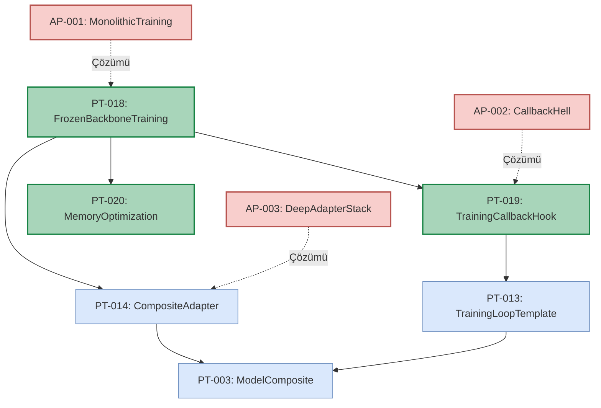
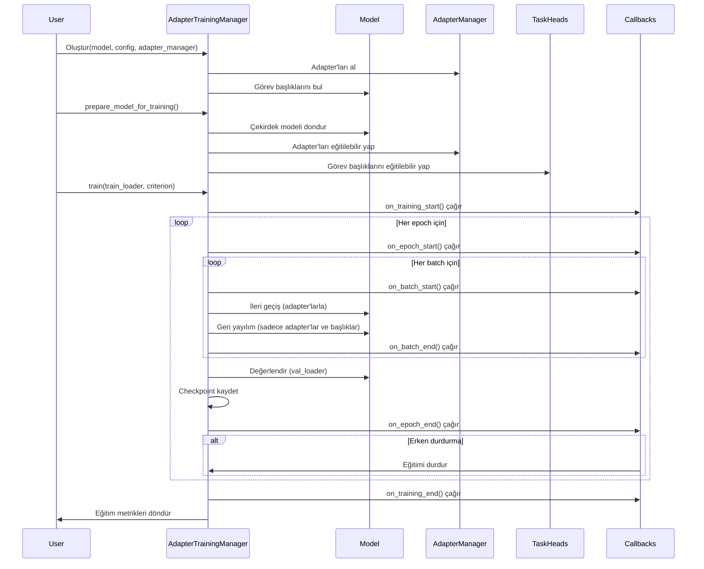
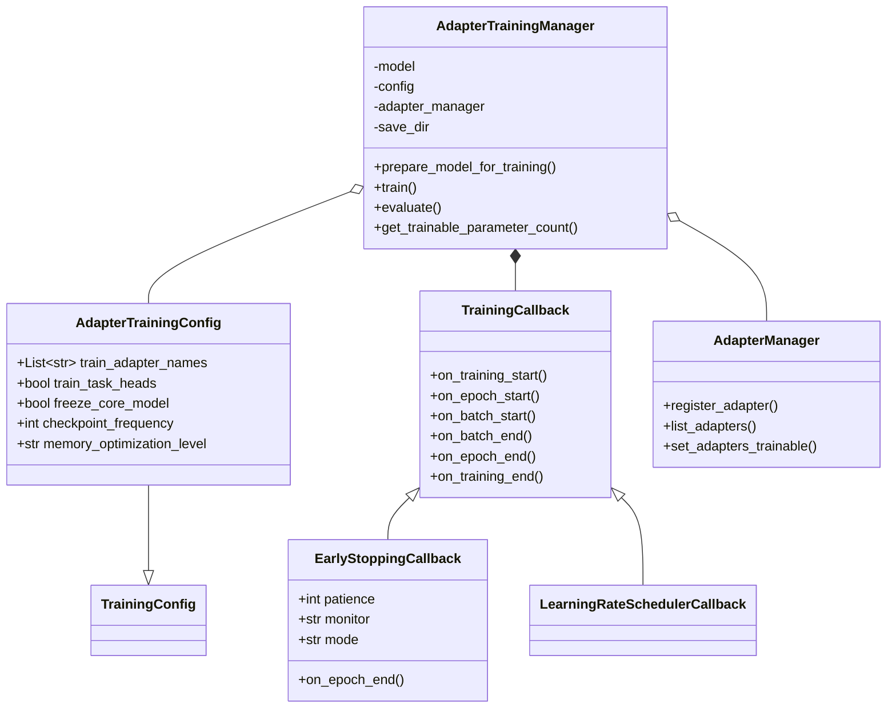
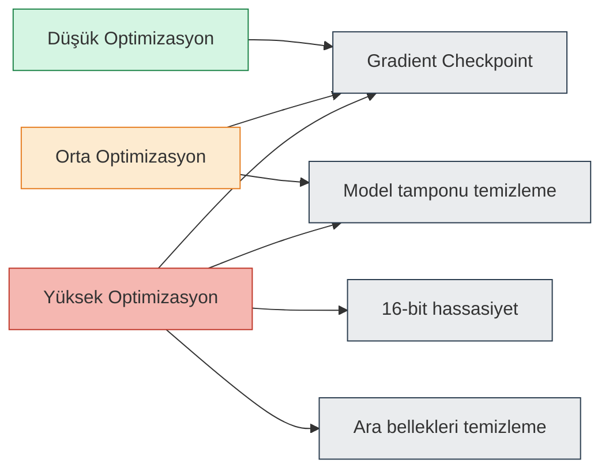

# Adapter ve Task Head Eğitim Mekanizması Pattern Mimarisi

Bu diyagram, M³TM modelinde adapter ve task head eğitimi için kullanılan pattern'lerin ilişkilerini göstermektedir.

## Pattern İlişki Diyagramı

## Adapter Eğitim Akış Diyagramı

## Bileşen Diyagramı

## Bellek Optimizasyonu Seviye Diyagramı

Bu diyagramlar, M³TM modelindeki adapter ve task head eğitim mekanizmasının mimarisini, akışını, bileşenlerini ve bellek optimizasyon seviyelerini göstermektedir. 