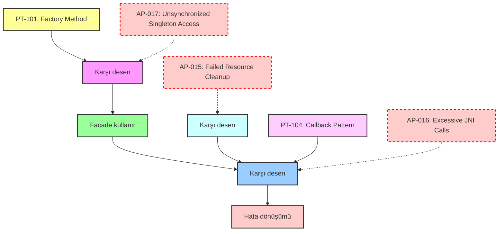
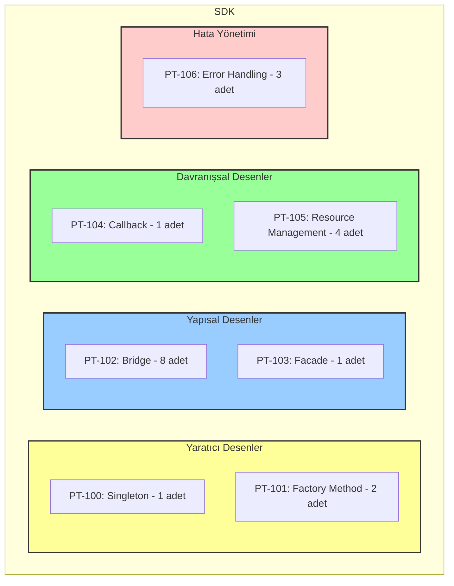

# M³TM Android SDK Desen Görselleştirmesi

Bu görselleştirme dosyası, M³TM v2.3 Android SDK'sında kullanılan tasarım desenlerini ve aralarındaki ilişkileri göstermektedir.

## Desen İlişki Diyagramı



## Desen Dağılımı (TreeMap)



## Desen Etkinlik Grafiği

```
Etkinlik Skoru (0-1)
^
|
|                  * PT100 (0.95)
|                * PT103 (0.95)
|               * PT102 (0.94)
|              * PT105 (0.93)
|             * PT101 (0.92)
|             * PT106 (0.92)
|            * PT104 (0.90)
|
+----------------------------------------->
   Desen
```

## Desen Kullanım Haritası

```
Sınıf / Desen | PT-100 | PT-101 | PT-102 | PT-103 | PT-104 | PT-105 | PT-106
--------------|--------|--------|--------|--------|--------|--------|--------
M3TM          |   X    |        |        |   X    |        |   X    |        
M3TMModel     |        |        |   X    |        |        |   X    |        
M3TMModelMgr  |        |   X    |   X    |        |        |   X    |   X    
M3TMTrainingMgr|       |   X    |   X    |        |        |   X    |   X    
TrainingCB    |        |        |        |        |   X    |        |        
M3TMException |        |        |        |        |        |        |   X    
```

## Desen Olgunluk Isı Haritası

```
       PT-100    PT-101    PT-102    PT-103    PT-104    PT-105    PT-106
       ------    ------    ------    ------    ------    ------    ------
Etkk   █████     █████     █████     █████     ████▓     █████     █████
Tutr   █████     █████     █████     █████     █████     █████     █████
Bakm   █████     ████▓     ████▓     █████     ████▓     ████▓     █████
Genl   ████▓     █████     █████     ████▓     ████▓     ████▓     ████▓
Test   ████▓     █████     ████▓     ████▓     █████     █████     █████

█████ = Mükemmel (0.9-1.0)
████▓ = İyi (0.8-0.9)
███▓▓ = Orta (0.7-0.8)
██▓▓▓ = Geliştirilmeli (0.6-0.7)
█▓▓▓▓ = Zayıf (<0.6)

Etkk = Etkinlik
Tutr = Tutarlılık
Bakm = Bakım Kolaylığı
Genl = Genişletilebilirlik
Test = Test Edilebilirlik
```

## Desen Evrim Zaman Çizelgesi

```
2024-06-11 --------------------------------------------------------------------------
         |                                                                          
         |  PT-100, PT-101, PT-102, PT-103, PT-104, PT-105, PT-106                  
         |  (Android SDK Desenlerinin İlk Belgelendirilmesi)                       
         |                                                                          
Gelecek  --------------------------------------------------------------------------
         |                                                                          
         |  PT-104 -> Callback Deseninin Gelişimi                                   
         |  (Daha Granüler Callback'ler Eklenmesi)                                 
         |                                                                          
         |  PT-105 -> AutoCloseable İmplementasyonu                                 
         |  (Try-with-resources desteği)                                           
         |                                                                          
```

Bu görselleştirmeler, Android SDK desenlerinin ilişkilerini, dağılımını, etkinliğini ve evrimini anlamak için yardımcı olabilir. 