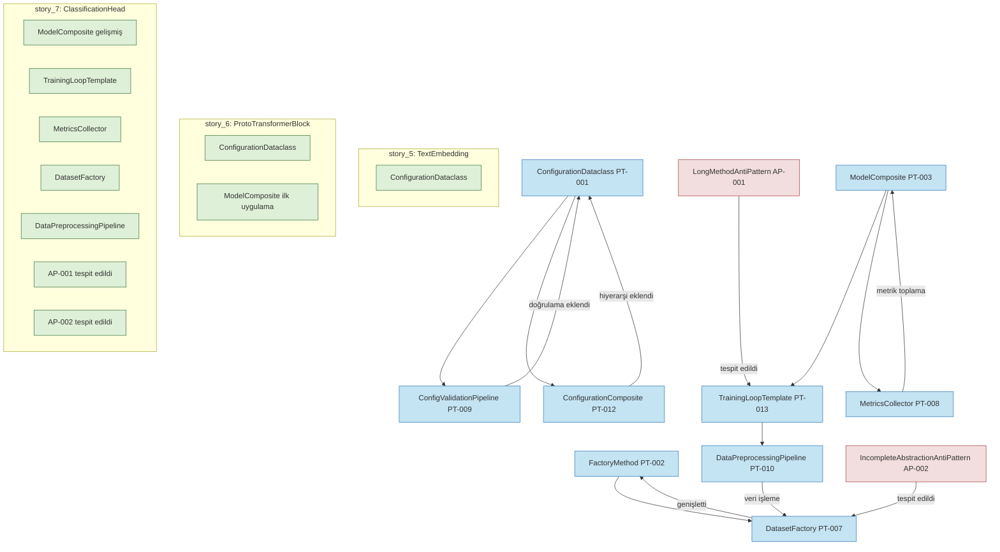

# Desen Evrim Grafiği

## Örüntü Evrim Trendleri

1. **Kompozit Desenlerin Artışı**
   - İlk hikayelerden itibaren, yapılandırma için `ConfigurationDataclass` ve `ConfigurationComposite` örüntüleri uygulanmıştır
   - `story_6` ile `ModelComposite` deseninin temel uygulaması başlamıştır
   - `story_7` ile bu desen genişletilmiş ve `TrainingLoopTemplate` ile entegre edilmiştir

2. **Fabrika Desenlerinin Gelişimi**
   - Temel `FactoryMethod` deseni birkaç modülde uygulanmıştır
   - `story_7` ile daha özelleşmiş `DatasetFactory` eklenerek veri işleme için genişletilmiştir

3. **Anti-desen Tespiti**
   - `story_7` ile ilk anti-desenler tespit edilmiştir
   - İlgi çekici bir şekilde, gelişmiş desenlerin eklenmesi, anti-desenlerin daha belirgin hale gelmesini sağlamıştır

## Gelecek Beklentileri

1. **Görüntü Modalitesi için Genişletme**
   - `story_8` ile `ModelComposite` deseninin görüntü işleme için genişletilmesi beklenmektedir
   - `DataPreprocessingPipeline` deseni görüntü verilerini de kapsayacak şekilde genişletilmelidir

2. **Anti-desen Refaktörleme**
   - Tespit edilen anti-desenlerin refaktörleme ile giderilmesi
   - Refaktörleme sonrasında desen etkinliğinin izlenmesi

3. **Test Desenlerinin Eklenmesi**
   - Test edilebilirliği artırmak için test desenleri eklenmelidir 