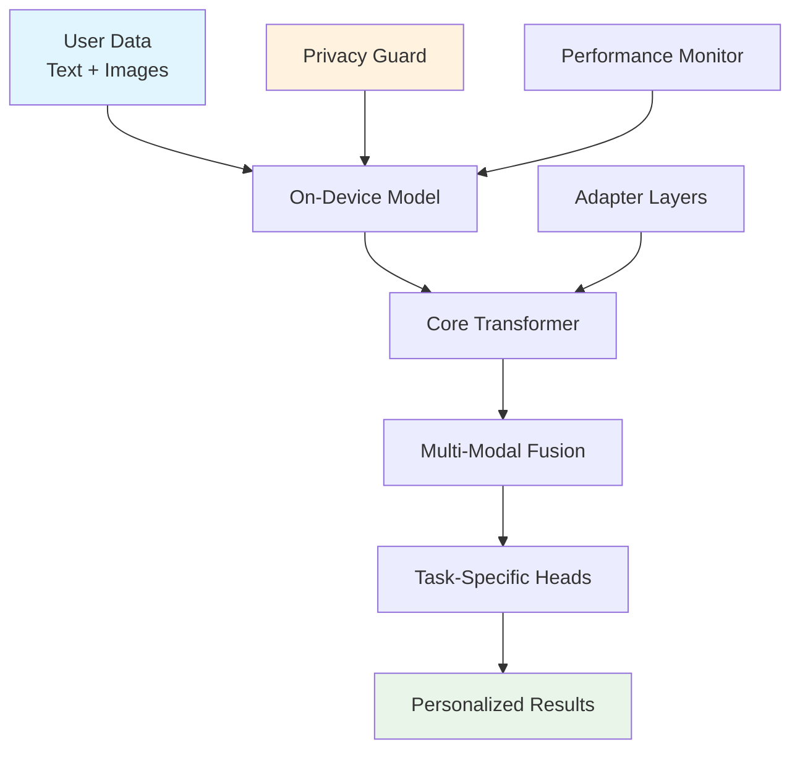

# M³TM Developer Hub

<div class="hero-section" markdown>

# Build Privacy-First AI Apps with M³TM

**M³TM** is a lightweight, multi-modal transformer that runs entirely on-device, enabling developers to build powerful AI applications that respect user privacy.

[Get Started :material-rocket-launch:](getting-started/quick-start.md){ .md-button .md-button--primary }
[View Examples :material-code-braces:](examples/sample-apps.md){ .md-button }
[API Reference :material-book-open-page-variant:](api/core/index.md){ .md-button }

</div>

## What Makes M³TM Special?

<div class="grid cards" markdown>

-   :material-shield-check:{ .lg .middle } **Privacy-First**

    ---

    All user data stays on-device. No cloud dependencies, no data collection, complete user control over their information.

    [:octicons-arrow-right-24: Learn about privacy](getting-started/privacy.md)

-   :material-memory:{ .lg .middle } **Ultra-Lightweight**

    ---

    Optimized for mobile devices with minimal memory footprint and efficient inference on ARM processors.

    [:octicons-arrow-right-24: View benchmarks](tutorials/optimization.md)

-   :material-puzzle-outline:{ .lg .middle } **Multi-Modal**

    ---

    Process text and images together with built-in fusion mechanisms for rich AI experiences.

    [:octicons-arrow-right-24: Explore modalities](tutorials/multimodal.md)

-   :material-wrench-outline:{ .lg .middle } **Developer-Friendly**

    ---

    Simple APIs, comprehensive documentation, and powerful developer tools for rapid prototyping.

    [:octicons-arrow-right-24: Start building](getting-started/quick-start.md)

</div>

## Quick Start

Get up and running with M³TM in under 5 minutes:

=== "Android"

    ```kotlin
    // Add to your build.gradle
    implementation 'com.m3tm:android-sdk:2.3.0'

    // Initialize the model
    val model = M3TM.builder()
        .setModelConfig(ModelConfig.DEFAULT)
        .build()

    // Run inference
    val result = model.infer(
        text = "Hello world",
        image = loadImage("sample.jpg")
    )
    ```

=== "iOS"

    ```swift
    // Add to your Package.swift
    .package(url: "https://github.com/m3tm/ios-sdk", from: "2.3.0")

    // Initialize the model
    let model = try M3TM(config: .default)

    // Run inference
    let result = try await model.infer(
        text: "Hello world",
        image: UIImage(named: "sample")
    )
    ```

=== "Python"

    ```python
    # Install the package
    pip install m3tm

    # Initialize the model
    from m3tm import M3TM

    model = M3TM.from_pretrained("m3tm-v2.3")

    # Run inference
    result = model.infer(
        text="Hello world",
        image="sample.jpg"
    )
    ```

## Featured Examples

<div class="grid cards" markdown>

-   :material-android:{ .lg .middle } **Photo Assistant**

    ---

    Build an intelligent photo organization app that understands content and creates searchable collections.

    [:octicons-arrow-right-24: View example](examples/photo-assistant.md)

-   :material-apple-ios:{ .lg .middle } **Smart Notes**

    ---

    Create a note-taking app with AI-powered search and content suggestions.

    [:octicons-arrow-right-24: View example](examples/smart-notes.md)

-   :material-chat-processing:{ .lg .middle } **Personal Assistant**

    ---

    Develop a private AI assistant that learns from user interactions.

    [:octicons-arrow-right-24: View example](examples/personal-assistant.md)

-   :material-shopping:{ .lg .middle } **Product Search**

    ---

    Implement visual product search in your e-commerce app.

    [:octicons-arrow-right-24: View example](examples/product-search.md)

</div>

## Latest Updates

<!-- mkdocs-latest-posts -->

## Community

Join our growing community of privacy-focused AI developers:

- [:fontawesome-brands-github: GitHub Discussions](https://github.com/m3tm/mobilemodel/discussions) - Ask questions and share your projects
- [:fontawesome-brands-discord: Discord Server](https://discord.gg/m3tm) - Real-time chat with the community
- [:fontawesome-brands-twitter: Twitter](https://twitter.com/m3tm_dev) - Follow for updates and announcements
- [:material-email: Newsletter](https://m3tm.dev/newsletter) - Monthly updates and tutorials

## Architecture Overview



## Performance Benchmarks

| Metric | M³TM v2.3 | Competitor A | Competitor B |
|--------|-----------|--------------|--------------|
| Model Size | **4.2 MB** | 15.8 MB | 12.3 MB |
| Inference Time | **23 ms** | 45 ms | 38 ms |
| Memory Usage | **28 MB** | 85 MB | 62 MB |
| Battery Impact | **<1%/hour** | 3.2%/hour | 2.8%/hour |

!!! tip "Getting Started"
    
    New to M³TM? Start with our [Quick Start Guide](getting-started/quick-start.md) to build your first app in minutes!

!!! info "Version 2.3 Features"
    
    - Enhanced performance optimization
    - Improved multi-modal fusion
    - Extended developer tools
    - Advanced security features
